```{r}
#| include: false
library(dplyr)
library(ggplot2)
library(plotly)
library(DT)
library(htmlwidgets)
library(pharmaverseadamjnj)

output_dir <- "interactive-outputs"
dir.create(output_dir, showWarnings = FALSE, recursive = TRUE)

adsl <- pharmaverseadamjnj::adsl

adsl2 <- adsl %>%
  select(USUBJID, TRT01P, TRTDURD, WEIGHTBL, HEIGHTBL) %>%
  filter(!is.na(TRT01P) & !is.na(TRTDURD))

adsl3 <- adsl2 %>%
  mutate_if(is.character, as.factor)

tf_colors <- c(
  "Placebo" = "#0072B2",
  "Xanomeline High Dose" = "#D55E00",
  "Xanomeline Low Dose" = "#CC79A7"
)

f1 <- ggplot(data = adsl3, aes(x = TRT01P, y = TRTDURD, fill = TRT01P)) +
  geom_boxplot() +
  scale_x_discrete(name = "Treatment Group") +
  scale_y_continuous(
    limits = c(0, 250),
    breaks = seq(0, 250, 50),
    expand = c(0.05, 0.05),
    name = "Treatment Duration (Days)"
  ) +
  scale_fill_manual(
    values = tf_colors,
    name = "Treatment Group"
  )

g1 <- ggplotly(f1)
saveWidget(g1, file.path(output_dir, "boxplotly.html"), selfcontained = TRUE)

f2 <- ggplot(data = adsl3, aes(x = HEIGHTBL, y = WEIGHTBL, shape = TRT01P, colour = TRT01P)) +
  geom_point() +
  scale_x_continuous(
    limits = c(0, 150),
    breaks = seq(0, 150, 10),
    name = "Baseline Height (cm)"
  ) +
  scale_y_continuous(
    limits = c(0, 150),
    breaks = seq(0, 150, 10),
    name = "Baseline Weight (kg)"
  ) +
  scale_shape_manual(
    values = c(16, 17, 15),
    name = "Treatment Group"
  ) +
  scale_colour_manual(
    values = tf_colors,
    name = "Treatment Group"
  )

g2 <- ggplotly(f2)
saveWidget(g2, file.path(output_dir, "scatterplotly.html"), selfcontained = TRUE)

my_table <- adsl3

my_table_2 <- my_table %>%
  rename(
    "Unique Subject Identifier" = USUBJID,
    "Treatment Group" = TRT01P,
    "Total Treatment Duration (Days)" = TRTDURD,
    "Baseline Weight (kg)" = WEIGHTBL,
    "Baseline Height (cm)" = HEIGHTBL
  )

d <- datatable(
  my_table_2,
  extensions = c("ColReorder"),
  rownames = FALSE,
  filter = "top",
  class = "stripe hover compact",
  options = list(
    colReorder = TRUE,
    pageLength = 5,
    lengthMenu = c(5, 10, 12, 20, 50, 100)
  )
)
saveWidget(d, file.path(output_dir, "datatable.html"), selfcontained = TRUE)

copy_block <- function(lines, language = "markdown") {
  fence <- paste(rep("`", 6), collapse = "")
  cat(fence, language, "\n", sep = "")
  cat(paste(lines, collapse = "\n"))
  cat("\n", fence, "\n", sep = "")
}

copy_file_block <- function(path, language = "r") {
  copy_block(readLines(path, warn = FALSE), language = language)
}
```

## Presentation

[Fast, Fresh & Interactive: R Dashboards for Statisticians in 30 Minutes or Less!](https://view.officeapps.live.com/op/view.aspx?src=https://raw.githubusercontent.com/PSIAIMS/website/main/presentations/PSI%20Conference%202026/PSI%20Conference%2016.06.26_16.15-17.30_Martin_Brown.pptx)


## Setup
### Package Installation

```r
install.packages("tibble", type = "binary")
install.packages("dplyr", type = "binary")
install.packages("ggplot2", type = "binary")
install.packages("plotly", type = "binary")
install.packages("DT", type = "binary")
install.packages("htmlwidgets", type = "binary")
install.packages("pharmaverseadamjnj")
```

### Package Load

```r
library(dplyr)
library(ggplot2)
library(plotly)
library(DT)
library(htmlwidgets)
library(pharmaverseadamjnj)
```

### Read in ADSL and carry out some data preparation

```r
adsl <- pharmaverseadamjnj::adsl

adsl2 <- adsl %>%
  select(USUBJID, TRT01P, TRTDURD, WEIGHTBL, HEIGHTBL) %>%
  filter(!is.na(TRT01P) & !is.na(TRTDURD))

adsl3 <- adsl2 %>%
  mutate_if(is.character, as.factor)

tf_colors <- c(
  "Placebo" = "#0072B2",
  "Xanomeline High Dose" = "#D55E00",
  "Xanomeline Low Dose" = "#CC79A7"
)
```

## Recipe 1: Make A Figure Interactive

### Boxplot: Create The Static Figure

```r
f1 <- ggplot(data = adsl3, aes(x = TRT01P, y = TRTDURD, fill = TRT01P)) +
  geom_boxplot() +
  scale_x_discrete(name = "Treatment Group") +
  scale_y_continuous(
    limits = c(0, 250),
    breaks = seq(0, 250, 50),
    expand = c(0.05, 0.05),
    name = "Treatment Duration (Days)"
  ) +
  scale_fill_manual(
    values = tf_colors,
    name = "Treatment Group"
  )
```

```{r}
#| fig-width: 8
#| fig-height: 4.8
f1
```

### Boxplot: Make It Interactive

```r
g1 <- ggplotly(f1)

saveWidget(g1, "boxplotly.html", selfcontained = TRUE)
```

```{r}
g1
```

[Open the interactive boxplot](interactive-outputs/boxplotly.html)

### Scatterplot: Create The Static Figure

```r
f2 <- ggplot(data = adsl3, aes(x = HEIGHTBL, y = WEIGHTBL, shape = TRT01P, colour = TRT01P)) +
  geom_point() +
  scale_x_continuous(
    limits = c(0, 150),
    breaks = seq(0, 150, 10),
    name = "Baseline Height (cm)"
  ) +
  scale_y_continuous(
    limits = c(0, 150),
    breaks = seq(0, 150, 10),
    name = "Baseline Weight (kg)"
  ) +
  scale_shape_manual(
    values = c(16, 17, 15),
    name = "Treatment Group"
  ) +
  scale_colour_manual(
    values = tf_colors,
    name = "Treatment Group"
  )
```

```{r}
#| fig-width: 8
#| fig-height: 4.8
f2
```

### Scatterplot: Make It Interactive

```r
g2 <- ggplotly(f2)

saveWidget(g2, "scatterplotly.html", selfcontained = TRUE)
```

```{r}
g2
```

[Open the interactive scatterplot](interactive-outputs/scatterplotly.html)

## Recipe 2: Make A Table Explorable

### Prepare The Table

```r
my_table <- adsl3

my_table_2 <- my_table %>%
  rename(
    "Unique Subject Identifier" = USUBJID,
    "Treatment Group" = TRT01P,
    "Total Treatment Duration (Days)" = TRTDURD,
    "Baseline Weight (kg)" = WEIGHTBL,
    "Baseline Height (cm)" = HEIGHTBL
  )
```

### Make It Interactive

```r
d <- datatable(
  my_table_2,
  extensions = c("ColReorder"),
  rownames = FALSE,
  filter = "top",
  class = "stripe hover compact",
  options = list(
    colReorder = TRUE,
    pageLength = 5,
    lengthMenu = c(5, 10, 12, 20, 50, 100)
  )
)

saveWidget(d, "datatable.html", selfcontained = TRUE)
```

```{r}
d
```

[Open the interactive table](interactive-outputs/datatable.html)

## Recipe 3: Bring Outputs Together

The final dashboard uses the same building blocks from the recipes above, but places them inside a Quarto dashboard layout.

The main Quarto ideas are:

- **YAML**: the block at the top between `---` lines controls the document type. For the dashboard, `format: dashboard` tells Quarto to create a dashboard rather than a standard web page.
- **Code chunks**: R code is placed between triple backticks, for example ```` ```{r} ```` and ```` ``` ````. Quarto runs these chunks when the page is rendered.
- **Rows**: second-level headings such as `## Row {height="48%"}` create horizontal dashboard rows.
- **Cards**: each output chunk inside a row becomes a dashboard card.
- **Card titles**: chunk options such as `#| title: "Subject-Level Data"` give cards their titles.
- **Same recipe objects**: the dashboard reuses the same `f1`, `g1`, `f2`, `g2`, and `d` pattern from Recipes 1 and 2.

[Open the Quarto dashboard](../../assets/psi-conf-2026-dashboard.html)

</details>

<details id="dashboard-full-code">
<summary><strong>Quarto Dashboard Full Code</strong></summary>

```{r}
#| results: asis
qmd_fence <- "```"
r_fence <- paste0(qmd_fence, "{r}")
display_fence <- paste0(qmd_fence, qmd_fence)

dashboard_code <- c(
  "---",
  'title: "Quarto Dashboard"',
  "output-file: psi-conf-2026-dashboard.html",
  "format:",
  "  dashboard:",
  "    theme: cosmo",
  "    embed-resources: true",
  "execute:",
  "  echo: false",
  "  warning: false",
  "  message: false",
  "---",
  "",
  r_fence,
  "# Run once if needed:",
  '# install.packages("rmarkdown")',
  '# install.packages("tibble")',
  '# install.packages("dplyr")',
  '# install.packages("ggplot2")',
  '# install.packages("plotly")',
  '# install.packages("DT")',
  '# install.packages("htmlwidgets")',
  '# install.packages("pharmaverseadamjnj")',
  "",
  "library(dplyr)",
  "library(ggplot2)",
  "library(plotly)",
  "library(DT)",
  "library(htmlwidgets)",
  "library(pharmaverseadamjnj)",
  "",
  "adsl <- pharmaverseadamjnj::adsl",
  "",
  "adsl2 <- adsl %>%",
  "  select(USUBJID, TRT01P, TRTDURD, WEIGHTBL, HEIGHTBL) %>%",
  "  filter(!is.na(TRT01P) & !is.na(TRTDURD))",
  "",
  "adsl3 <- adsl2 %>%",
  "  mutate_if(is.character, as.factor)",
  "",
  "tf_colors <- c(",
  '  "Placebo" = "#0072B2",',
  '  "Xanomeline High Dose" = "#D55E00",',
  '  "Xanomeline Low Dose" = "#CC79A7"',
  ")",
  qmd_fence,
  "",
  '## Row {height="48%"}',
  "",
  r_fence,
  '#| title: "Treatment Duration (Days) by Treatment Group"',
  "f1 <- ggplot(data = adsl3, aes(x = TRT01P, y = TRTDURD, fill = TRT01P)) +",
  "  geom_boxplot() +",
  '  scale_x_discrete(name = "Treatment Group") +',
  "  scale_y_continuous(",
  "    limits = c(0, 250),",
  "    breaks = seq(0, 250, 50),",
  "    expand = c(0.05, 0.05),",
  '    name = "Treatment Duration (Days)"',
  "  ) +",
  "  scale_fill_manual(",
  "    values = tf_colors,",
  '    name = "Treatment Group"',
  "  ) +",
  "  theme_bw() +",
  '  theme(legend.position = "top")',
  "",
  "g1 <- ggplotly(f1) %>%",
  "  layout(",
  "    legend = list(",
  '      orientation = "h",',
  "      x = 0.5,",
  '      xanchor = "center",',
  "      y = 1.02,",
  '      yanchor = "bottom"',
  "    ),",
  "    margin = list(t = 45)",
  "  )",
  "",
  "g1",
  qmd_fence,
  "",
  r_fence,
  '#| title: "Baseline Weight (kg) vs Baseline Height (cm)"',
  "f2 <- ggplot(",
  "  data = adsl3,",
  "  aes(x = HEIGHTBL, y = WEIGHTBL, shape = TRT01P, colour = TRT01P)",
  ") +",
  "  geom_point() +",
  "  scale_x_continuous(",
  "    limits = c(0, 150),",
  "    breaks = seq(0, 150, 10),",
  '    name = "Baseline Height (cm)"',
  "  ) +",
  "  scale_y_continuous(",
  "    limits = c(0, 150),",
  "    breaks = seq(0, 150, 10),",
  '    name = "Baseline Weight (kg)"',
  "  ) +",
  "  scale_shape_manual(",
  "    values = c(16, 17, 15),",
  '    name = "Treatment Group"',
  "  ) +",
  "  scale_colour_manual(",
  "    values = tf_colors,",
  '    name = "Treatment Group"',
  "  ) +",
  "  theme_bw() +",
  '  theme(legend.position = "top")',
  "",
  "g2 <- ggplotly(f2) %>%",
  "  layout(",
  "    legend = list(",
  '      orientation = "h",',
  "      x = 0.5,",
  '      xanchor = "center",',
  "      y = 1.02,",
  '      yanchor = "bottom"',
  "    ),",
  "    margin = list(t = 45)",
  "  )",
  "",
  "g2",
  qmd_fence,
  "",
  '## Row {height="52%"}',
  "",
  r_fence,
  '#| title: "Subject-Level Data"',
  "my_table <- adsl3",
  "",
  "my_table_2 <- my_table %>%",
  "  rename(",
  '    "Unique Subject Identifier" = USUBJID,',
  '    "Treatment Group" = TRT01P,',
  '    "Total Treatment Duration (Days)" = TRTDURD,',
  '    "Baseline Weight (kg)" = WEIGHTBL,',
  '    "Baseline Height (cm)" = HEIGHTBL',
  "  )",
  "",
  "d <- datatable(",
  "  my_table_2,",
  '  extensions = c("ColReorder"),',
  "  rownames = FALSE,",
  '  filter = "top",',
  '  class = "stripe hover compact",',
  "  fillContainer = FALSE,",
  "  autoHideNavigation = FALSE,",
  "  options = list(",
  "    colReorder = TRUE,",
  "    bPaginate = TRUE,",
  "    paging = TRUE,",
  "    lengthChange = TRUE,",
  "    searching = TRUE,",
  "    info = TRUE,",
  "    pageLength = 5,",
  "    lengthMenu = c(5, 10, 12, 20, 50, 100),",
  "    dom = '<\"top\"lf>rt<\"bottom\"ip>',",
  "    language = list(",
  '      info = "Showing _START_ to _END_ of _TOTAL_ entries"',
  "    )",
  "  )",
  ")",
  "",
  "d",
  qmd_fence
)

cat(display_fence, "markdown\n", sep = "")
cat(paste(dashboard_code, collapse = "\n"))
cat("\n", display_fence, "\n", sep = "")
```

</details>


- To see more Quarto examples, please visit: <https://quarto.org/docs/gallery/>

## Recipe 4: From Quarto dashboard to Shiny app using AI prompts

This recipe shows how the same dashboard code can become the starting point for a Shiny app. The prompts are deliberately iterative: first convert the Quarto dashboard, then add filters, then add more polished controls and downloads, then improve the visual design.

Each prompt asks for the full `app.R` code so the result can be copied into RStudio and run as a Shiny app.

### Prompt 1: Convert The Quarto Dashboard To Shiny

```{r}
#| results: asis
copy_block(c(
  "I have already created a Quarto dashboard using the code below. Please convert this into a simple Shiny app that keeps the same data, plots, table, and overall purpose.",
  "",
  "At the top of the script, include robust package setup code that:",
  "- sets the CRAN repository to Posit Package Manager: https://packagemanager.posit.co/cran/latest",
  '- installs required packages as binaries where possible using type = "binary"',
  "- avoids reinstalling packages that are already installed",
  "- does not load packages until all package checks are complete",
  "- have library calls for all required packages after package install.",
  "",
  "Please reuse as much of the existing Quarto logic as possible, but restructure it into standard Shiny ui and server code.",
  "",
  "Here is the Quarto dashboard code:",
  "",
  "<PASTE QUARTO DASHBOARD CODE FROM BEFORE HERE>"
))
```

Generated app code: [basic Shiny app](interactive-outputs/shiny-app-01-basic.txt)

<details>
<summary><strong>Preview</strong></summary>

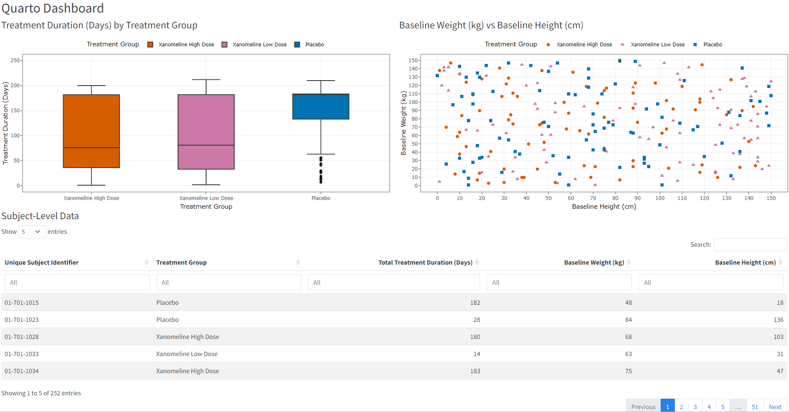{fig-alt="Quarto Dashboard converted to Shiny."}

</details>

### Prompt 2: Add Sidebar Filters

Prompt builder request:

```{r}
#| results: asis
copy_block(c(
  "Give me a prompt to update this Shiny app:",
  "- giving the full code",
  "- just updating the first version of the code that was given previously",
  "- Add a sidebar with:",
  "  - treatment group filter dropdown menu (multiple choice)",
  "  - subject filter dropdown menu (multiple choice)",
  "  - sliders for duration, weight, and height",
  "- Ensure all plots and the table respond to these filters"
))
```

Prompt used:

```{r}
#| results: asis
copy_block(c(
  "Please update the first Shiny app version you gave me previously.",
  "",
  "Give me the full updated `app.R` code, not just snippets.",
  "",
  "Keep the same data source, plots, table, package setup section, colors, and overall app purpose.",
  "",
  "Add a sidebar containing these filters:",
  "",
  "* Treatment group filter dropdown menu, allowing multiple selections",
  "* Subject filter dropdown menu, allowing multiple selections",
  "* Treatment duration slider",
  "* Baseline weight slider",
  "* Baseline height slider",
  "",
  "Requirements:",
  "",
  "* The filters should be based on the available values in `adsl3`.",
  "* All filters should have sensible defaults that include all available data.",
  "* The treatment group and subject dropdowns should support multiple selections.",
  "* The duration, weight, and height sliders should use the observed data ranges.",
  "* The two Plotly plots and the DT table must all respond to every filter.",
  "* Reuse as much of the original Shiny app logic as possible.",
  "* Keep the standard Shiny `ui` and `server` structure.",
  "* Include robust package setup at the top exactly as before:",
  "  * Set CRAN repository to Posit Package Manager: `https://packagemanager.posit.co/cran/latest`",
  '  * Install required packages as binaries where possible using `type = "binary"`',
  "  * Avoid reinstalling packages that are already installed",
  "  * Do not load packages until all package checks are complete",
  "  * Include `library()` calls for all required packages after package installation"
))
```

Generated app code: [Shiny app with filters](interactive-outputs/shiny-app-02-filters.txt)

<details>
<summary><strong>Preview</strong></summary>

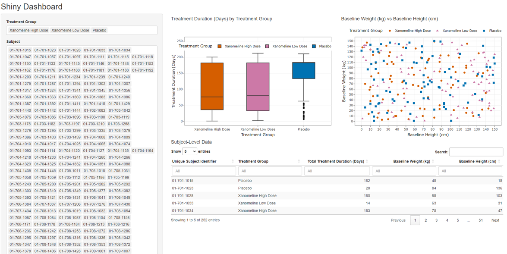{fig-alt="Sidebar Filters Added."}

</details>

### Prompt 3: Improve The Filters And Add Downloads

Prompt builder request:

```{r}
#| results: asis
copy_block(c(
  "Give me a prompt to update this Shiny app:",
  "- giving the full code",
  "- just updating the first version of the code that was given previously",
  "- Change the treatment and subject filters to be like this image where we can still choose multiple values",
  "- Add buttons in the sidebar for the user to be able to download static files"
))
```

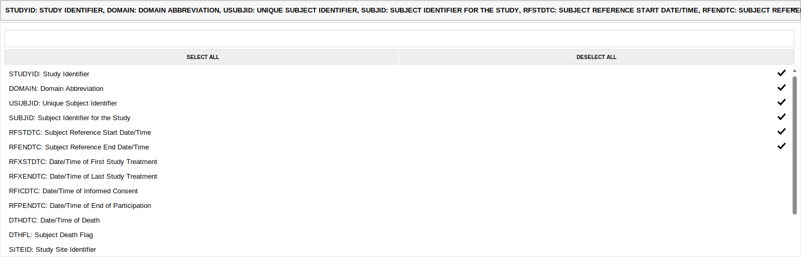{fig-alt="Example multi-select dropdown with search, Select All, Deselect All, and selected checkmarks."}


Prompt used:

```{r}
#| results: asis
copy_block(c(
  "Please update the first Shiny app version you gave me previously.",
  "",
  "Give me the full updated `app.R` code, not just a patch.",
  "",
  "Keep the same data source, plots, table, colors, and overall app purpose.",
  "",
  "Update only the first Shiny app code from earlier, incorporating the existing sidebar filter version where appropriate.",
  "",
  "Change the Treatment Group and Subject filters so they look and behave like the screenshot:",
  "",
  "* Use multi-select dropdowns that support selecting multiple values.",
  "* Show selected values in the collapsed input as comma-separated text.",
  "* Include a search box inside each dropdown.",
  "* Include Select All and Deselect All controls.",
  "* Show checkmarks for selected items.",
  "* Keep all treatment groups and all subjects selected by default.",
  "",
  "Add sidebar buttons that allow the user to download static files:",
  "",
  "* Download the Treatment Duration plot as a static image file.",
  "* Download the Baseline Weight vs Baseline Height plot as a static image file.",
  "* Download the filtered subject-level table as a CSV file.",
  "",
  "Requirements:",
  "",
  "* Keep the existing robust package setup at the top:",
  "  * Set CRAN repository to `https://packagemanager.posit.co/cran/latest`",
  '  * Install missing required packages using `type = "binary"`',
  "  * Avoid reinstalling already installed packages",
  "  * Do not load packages until all package checks are complete",
  "  * Include `library()` calls after package installation",
  "* Add any additional packages needed for the improved multi-select inputs or static downloads to the package setup.",
  "* Use a reactive filtered dataset in the server.",
  "* All plots and the DT table must respond to all filters.",
  "* The static download buttons should download the currently filtered outputs.",
  "* Reuse as much of the existing Shiny app logic as possible.",
  "* Return only the complete updated `app.R` code."
))
```

Generated app code: [Shiny app with improved filters and downloads](interactive-outputs/shiny-app-03-downloads.txt)

<details>
<summary><strong>Preview</strong></summary>

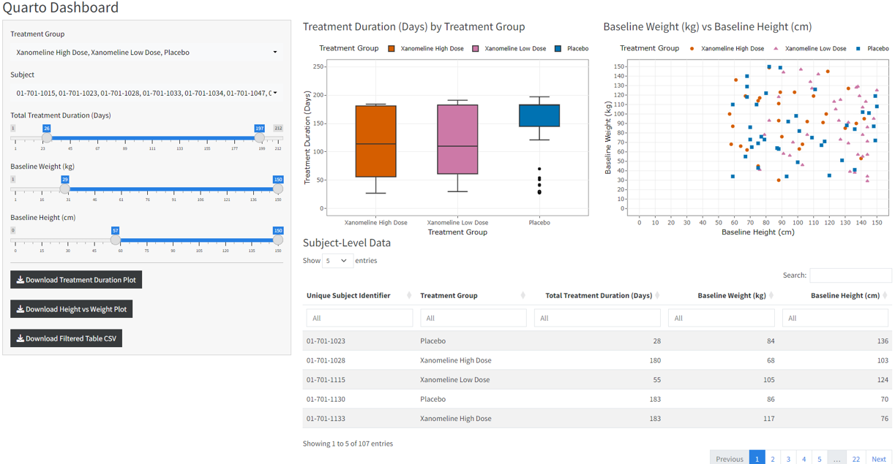{fig-alt="Sidebar Filters Improved and Downloads Added."}

</details>

### Prompt 4: Improve The Name And Design

Prompt builder request:

```{r}
#| results: asis
copy_block(c(
  "Give me a prompt to update this Shiny app:",
  "- giving the full code",
  "- just updating the first version of the code that was given previously",
  "- Give the dashboard a meaningful name",
  "- Improve the look"
))
```

Prompt used:

```{r}
#| results: asis
copy_block(c(
  "Please update the first Shiny app version you gave me previously.",
  "",
  "Give me the full updated `app.R` code, not just a patch.",
  "",
  "Keep the same data source, plots, table, colors, filters, downloads, and overall purpose.",
  "",
  "Update only the first Shiny app code from earlier, incorporating the current sidebar filter and download-button version where appropriate.",
  "",
  "Changes requested:",
  "",
  '* Give the dashboard a meaningful clinical-style name instead of "Quarto Dashboard".',
  "* Improve the visual design of the app while keeping it simple and professional.",
  "* Use a cleaner layout with a clear title/header area.",
  "* Improve spacing, alignment, and section headings.",
  "* Make the sidebar visually cleaner and easier to scan.",
  "* Make the plot and table areas look more polished, for example by using card-style containers or similar Shiny/bslib layout elements.",
  "* Keep the app appropriate for a clinical subject-level exploratory dashboard.",
  "",
  "Requirements:",
  "",
  "* Keep the robust package setup at the top.",
  "* Reuse as much of the existing Shiny app logic as possible.",
  "* All filters, plots, table, and download buttons must continue to work.",
  "* Return only the complete updated `app.R` code."
))
```

Generated app code: [polished Shiny app](interactive-outputs/shiny-app-04-polished.txt)

<details>
<summary><strong>Preview</strong></summary>

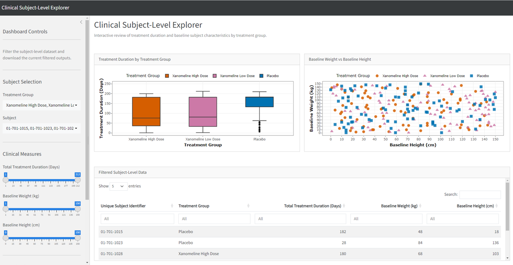{fig-alt="Name and Design Improved."}

</details>

## Recipe 5: Build A Survival Dashboard Using Shiny Assistant

This recipe uses Posit's Shiny Assistant to generate and then iteratively improve a Shiny app from natural-language prompts.

Links:

- [R Shiny Assistant introduction](https://shiny.posit.co/blog/posts/shiny-assistant/)
- [Shiny Assistant app](https://gallery.shinyapps.io/assistant/)

### Prompt 1: Create The Initial Survival Dashboard

```{r}
#| results: asis
copy_block(c(
  "Create a polished R Shiny dashboard for exploring simulated clinical trial survival data.",
  "",
  "Include:",
  "treatment group filter",
  "subgroup filter",
  "censoring rate slider",
  "",
  "Display:",
  "Kaplan-Meier plot",
  "number at risk table",
  "hazard ratio summary",
  "downloadable survival dataset",
  "",
  "Use a modern dashboard layout with reactive updates.",
  "Keep the code concise and runnable as a single app.R file."
))
```

Generated app code: [Shiny Assistant version 1](interactive-outputs/shiny-assistant-01.txt)

<details>
<summary><strong>Preview</strong></summary>

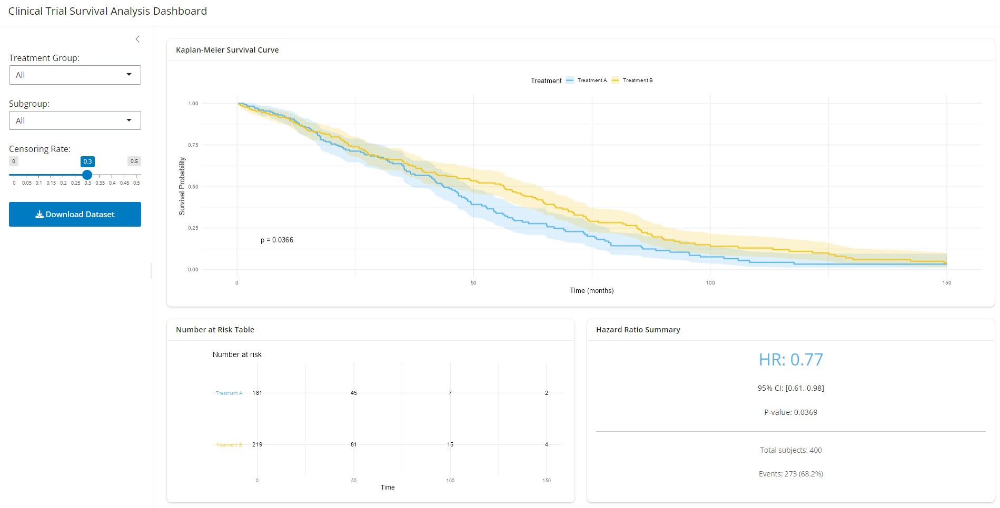{fig-alt="Initial Shiny Assistant survival dashboard."}

</details>

### Prompt 2: Add A Dataset Tab

```{r}
#| results: asis
copy_block(c(
  "Can I have the dataset on a second tab?"
))
```

Generated app code: [Shiny Assistant version 2](interactive-outputs/shiny-assistant-02.txt)

<details>
<summary><strong>Preview</strong></summary>

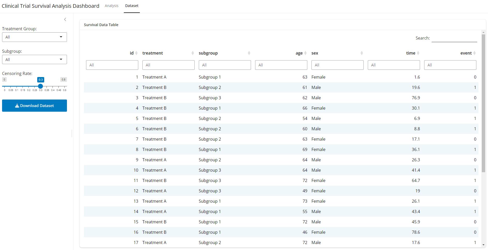{fig-alt="Dataset tab added to Shiny Assistant survival dashboard."}

</details>

### Prompt 3: Add Zoomable Cards

```{r}
#| results: asis
copy_block(c(
  "Can I have zoom in capabilities on each card?"
))
```

Generated app code: [Shiny Assistant version 3](interactive-outputs/shiny-assistant-03.txt)

<details>
<summary><strong>Preview</strong></summary>

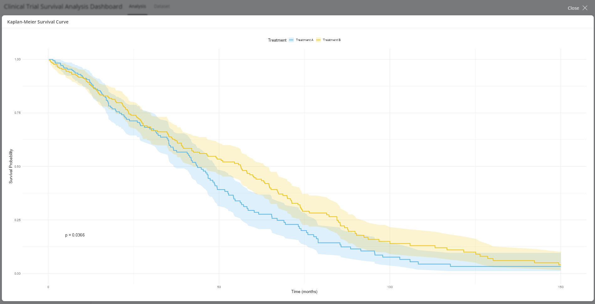{fig-alt="Zoomable cards added to Shiny Assistant survival dashboard."}

</details>

### Prompt 4: Add An Adjusted Cox Model Option

```{r}
#| results: asis
copy_block(c(
  'Add a checkbox called "Adjust Cox model for age and sex".'
))
```

Generated app code: [Shiny Assistant version 4](interactive-outputs/shiny-assistant-04.txt)

<details>
<summary><strong>Preview</strong></summary>

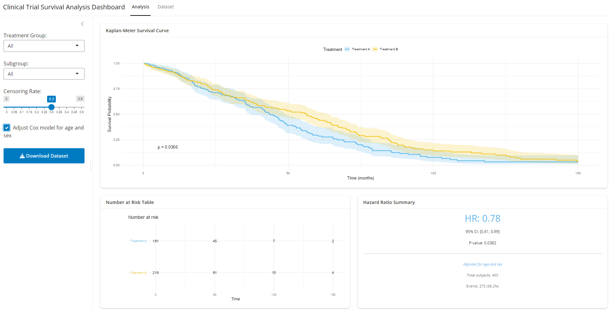{fig-alt="Adjusted Cox model option added to Shiny Assistant survival dashboard."}

</details>

## Recipe Book 1: Explore teal Apps

`teal` is a Shiny-based framework for interactive data exploration, with a particular focus on clinical trial data. It gives developers a standard structure for bringing in data, applying filters, adding analysis modules, and producing reproducible outputs.

In a `teal` app, the main building blocks are:

- **data**: passed into the app with `teal_data()` or clinical data helpers.
- **modules**: analysis components added with `modules()`.
- **filters**: shared filtering controls that can be applied across modules.
- **app wrapper**: `init()` brings the data and modules together into a Shiny app.

Useful links:

- [Getting started with teal](https://insightsengineering.github.io/teal/latest-tag/articles/getting-started-with-teal.html)
- [Main teal website](https://insightsengineering.github.io/teal/latest-tag/)

### Example 1: Basic teal App

This is the smallest useful pattern: load example data, pass it into `teal_data()`, add a simple module, then start the app.

Code: [basic teal app](interactive-outputs/teal-app-01.txt)

<details>
<summary><strong>Preview</strong></summary>

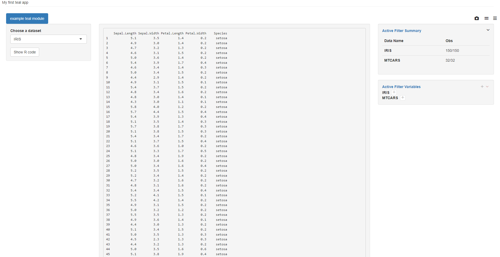{fig-alt="Basic teal app preview."}

</details>

### Example 2: Pre-Built teal Module

This example uses a pre-built clinical module. The app structure stays simple, but the module gives you a clinical-style output without writing the table logic from scratch.

Code: [pre-built teal app](interactive-outputs/teal-app-02.txt)

<details>
<summary><strong>Preview</strong></summary>

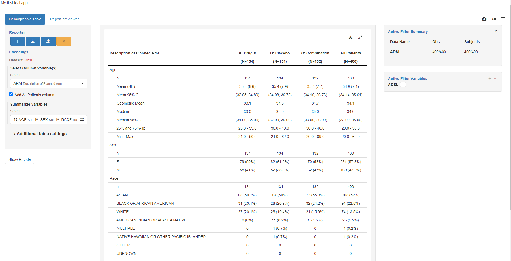{fig-alt="Pre-built teal module app preview."}

</details>

### Example 3: Custom teal Module

This example shows the next step: defining a custom module with its own UI and server logic, while still using the standard `teal` application wrapper.

Code: [custom teal app](interactive-outputs/teal-app-03.txt)

<details>
<summary><strong>Preview</strong></summary>

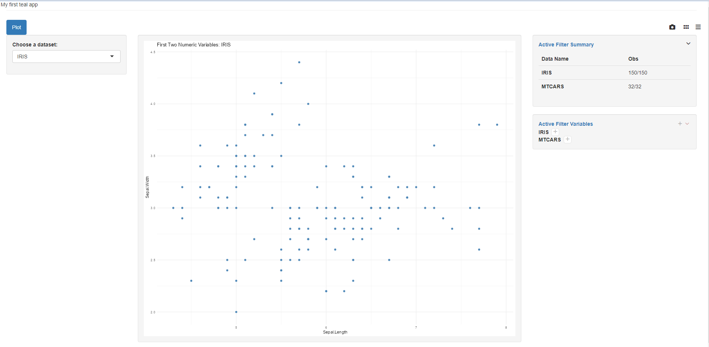{fig-alt="Custom teal module app preview."}

</details>

## Recipe Book 2: Explore AI Coding Tools

These tools show different ways to bring AI assistance into coding and app development workflows.

- [RStudio with Posit AI](https://docs.posit.co/ide/user/ide/guide/tools/posit-ai.html)
- [Posit AI](https://posit.ai/)
- [Positron](https://positron.posit.co/)
- [Claude Code](https://code.claude.com/docs/en)
- [Codex](https://openai.com/codex/)

## Full Code

<details id="boxplot-full-code">
<summary><strong>Boxplot Full Code</strong></summary>

```r
# PSI Conf 2026 interactivity recipes

install.packages("tibble", type = "binary")
install.packages("dplyr", type = "binary")
install.packages("ggplot2", type = "binary")
install.packages("plotly", type = "binary")
install.packages("htmlwidgets", type = "binary")
install.packages("pharmaverseadamjnj")

library(dplyr)
library(ggplot2)
library(plotly)
library(htmlwidgets)
library(pharmaverseadamjnj)

adsl <- pharmaverseadamjnj::adsl

adsl2 <- adsl %>%
  select(USUBJID, TRT01P, TRTDURD, WEIGHTBL, HEIGHTBL) %>%
  filter(!is.na(TRT01P) & !is.na(TRTDURD))

adsl3 <- adsl2 %>%
  mutate_if(is.character, as.factor)

tf_colors <- c(
  "Placebo" = "#0072B2",
  "Xanomeline High Dose" = "#D55E00",
  "Xanomeline Low Dose" = "#CC79A7"
)

f1 <- ggplot(data = adsl3, aes(x = TRT01P, y = TRTDURD, fill = TRT01P)) +
  geom_boxplot() +
  scale_x_discrete(name = "Treatment Group") +
  scale_y_continuous(
    limits = c(0, 250),
    breaks = seq(0, 250, 50),
    expand = c(0.05, 0.05),
    name = "Treatment Duration (Days)"
  ) +
  scale_fill_manual(
    values = tf_colors,
    name = "Treatment Group"
  )

g1 <- ggplotly(f1)

saveWidget(g1, "boxplotly.html", selfcontained = TRUE)
```

</details>

<details id="scatterplot-full-code">
<summary><strong>Scatterplot Full Code</strong></summary>

```r
# PSI Conf 2026 interactivity recipes

install.packages("tibble", type = "binary")
install.packages("dplyr", type = "binary")
install.packages("ggplot2", type = "binary")
install.packages("plotly", type = "binary")
install.packages("htmlwidgets", type = "binary")
install.packages("pharmaverseadamjnj")

library(dplyr)
library(ggplot2)
library(plotly)
library(htmlwidgets)
library(pharmaverseadamjnj)

adsl <- pharmaverseadamjnj::adsl

adsl2 <- adsl %>%
  select(USUBJID, TRT01P, TRTDURD, WEIGHTBL, HEIGHTBL) %>%
  filter(!is.na(TRT01P) & !is.na(TRTDURD))

adsl3 <- adsl2 %>%
  mutate_if(is.character, as.factor)

tf_colors <- c(
  "Placebo" = "#0072B2",
  "Xanomeline High Dose" = "#D55E00",
  "Xanomeline Low Dose" = "#CC79A7"
)

f2 <- ggplot(data = adsl3, aes(x = HEIGHTBL, y = WEIGHTBL, shape = TRT01P, colour = TRT01P)) +
  geom_point() +
  scale_x_continuous(
    limits = c(0, 150),
    breaks = seq(0, 150, 10),
    name = "Baseline Height (cm)"
  ) +
  scale_y_continuous(
    limits = c(0, 150),
    breaks = seq(0, 150, 10),
    name = "Baseline Weight (kg)"
  ) +
  scale_shape_manual(
    values = c(16, 17, 15),
    name = "Treatment Group"
  ) +
  scale_colour_manual(
    values = tf_colors,
    name = "Treatment Group"
  )

g2 <- ggplotly(f2)

saveWidget(g2, "scatterplotly.html", selfcontained = TRUE)
```

</details>

<details id="table-full-code">
<summary><strong>Table Full Code</strong></summary>

```r
# PSI Conf 2026 interactivity recipes

install.packages("tibble", type = "binary")
install.packages("dplyr", type = "binary")
install.packages("DT", type = "binary")
install.packages("htmlwidgets", type = "binary")
install.packages("pharmaverseadamjnj")

library(dplyr)
library(DT)
library(htmlwidgets)
library(pharmaverseadamjnj)

adsl <- pharmaverseadamjnj::adsl

adsl2 <- adsl %>%
  select(USUBJID, TRT01P, TRTDURD, WEIGHTBL, HEIGHTBL) %>%
  filter(!is.na(TRT01P) & !is.na(TRTDURD))

adsl3 <- adsl2 %>%
  mutate_if(is.character, as.factor)

my_table <- adsl3

my_table_2 <- my_table %>%
  rename(
    "Unique Subject Identifier" = USUBJID,
    "Treatment Group" = TRT01P,
    "Total Treatment Duration (Days)" = TRTDURD,
    "Baseline Weight (kg)" = WEIGHTBL,
    "Baseline Height (cm)" = HEIGHTBL
  )

d <- datatable(
  my_table_2,
  extensions = c("ColReorder"),
  rownames = FALSE,
  filter = "top",
  class = "stripe hover compact",
  options = list(
    colReorder = TRUE,
    pageLength = 5,
    lengthMenu = c(5, 10, 12, 20, 50, 100)
  )
)

saveWidget(d, "datatable.html", selfcontained = TRUE)
```

</details>

<details id="dashboard-full-code">
<summary><strong>Quarto Dashboard Full Code</strong></summary>

```{r}
#| results: asis
qmd_fence <- "```"
r_fence <- paste0(qmd_fence, "{r}")
display_fence <- paste0(qmd_fence, qmd_fence)

dashboard_code <- c(
  "---",
  'title: "Quarto Dashboard"',
  "output-file: psi-conf-2026-dashboard.html",
  "format:",
  "  dashboard:",
  "    theme: cosmo",
  "    embed-resources: true",
  "execute:",
  "  echo: false",
  "  warning: false",
  "  message: false",
  "---",
  "",
  r_fence,
  "# Run once if needed:",
  '# install.packages("rmarkdown")',
  '# install.packages("tibble")',
  '# install.packages("dplyr")',
  '# install.packages("ggplot2")',
  '# install.packages("plotly")',
  '# install.packages("DT")',
  '# install.packages("htmlwidgets")',
  '# install.packages("pharmaverseadamjnj")',
  "",
  "library(dplyr)",
  "library(ggplot2)",
  "library(plotly)",
  "library(DT)",
  "library(htmlwidgets)",
  "library(pharmaverseadamjnj)",
  "",
  "adsl <- pharmaverseadamjnj::adsl",
  "",
  "adsl2 <- adsl %>%",
  "  select(USUBJID, TRT01P, TRTDURD, WEIGHTBL, HEIGHTBL) %>%",
  "  filter(!is.na(TRT01P) & !is.na(TRTDURD))",
  "",
  "adsl3 <- adsl2 %>%",
  "  mutate_if(is.character, as.factor)",
  "",
  "tf_colors <- c(",
  '  "Placebo" = "#0072B2",',
  '  "Xanomeline High Dose" = "#D55E00",',
  '  "Xanomeline Low Dose" = "#CC79A7"',
  ")",
  qmd_fence,
  "",
  '## Row {height="48%"}',
  "",
  r_fence,
  '#| title: "Treatment Duration (Days) by Treatment Group"',
  "f1 <- ggplot(data = adsl3, aes(x = TRT01P, y = TRTDURD, fill = TRT01P)) +",
  "  geom_boxplot() +",
  '  scale_x_discrete(name = "Treatment Group") +',
  "  scale_y_continuous(",
  "    limits = c(0, 250),",
  "    breaks = seq(0, 250, 50),",
  "    expand = c(0.05, 0.05),",
  '    name = "Treatment Duration (Days)"',
  "  ) +",
  "  scale_fill_manual(",
  "    values = tf_colors,",
  '    name = "Treatment Group"',
  "  ) +",
  "  theme_bw() +",
  '  theme(legend.position = "top")',
  "",
  "g1 <- ggplotly(f1) %>%",
  "  layout(",
  "    legend = list(",
  '      orientation = "h",',
  "      x = 0.5,",
  '      xanchor = "center",',
  "      y = 1.02,",
  '      yanchor = "bottom"',
  "    ),",
  "    margin = list(t = 45)",
  "  )",
  "",
  "g1",
  qmd_fence,
  "",
  r_fence,
  '#| title: "Baseline Weight (kg) vs Baseline Height (cm)"',
  "f2 <- ggplot(",
  "  data = adsl3,",
  "  aes(x = HEIGHTBL, y = WEIGHTBL, shape = TRT01P, colour = TRT01P)",
  ") +",
  "  geom_point() +",
  "  scale_x_continuous(",
  "    limits = c(0, 150),",
  "    breaks = seq(0, 150, 10),",
  '    name = "Baseline Height (cm)"',
  "  ) +",
  "  scale_y_continuous(",
  "    limits = c(0, 150),",
  "    breaks = seq(0, 150, 10),",
  '    name = "Baseline Weight (kg)"',
  "  ) +",
  "  scale_shape_manual(",
  "    values = c(16, 17, 15),",
  '    name = "Treatment Group"',
  "  ) +",
  "  scale_colour_manual(",
  "    values = tf_colors,",
  '    name = "Treatment Group"',
  "  ) +",
  "  theme_bw() +",
  '  theme(legend.position = "top")',
  "",
  "g2 <- ggplotly(f2) %>%",
  "  layout(",
  "    legend = list(",
  '      orientation = "h",',
  "      x = 0.5,",
  '      xanchor = "center",',
  "      y = 1.02,",
  '      yanchor = "bottom"',
  "    ),",
  "    margin = list(t = 45)",
  "  )",
  "",
  "g2",
  qmd_fence,
  "",
  '## Row {height="52%"}',
  "",
  r_fence,
  '#| title: "Subject-Level Data"',
  "my_table <- adsl3",
  "",
  "my_table_2 <- my_table %>%",
  "  rename(",
  '    "Unique Subject Identifier" = USUBJID,',
  '    "Treatment Group" = TRT01P,',
  '    "Total Treatment Duration (Days)" = TRTDURD,',
  '    "Baseline Weight (kg)" = WEIGHTBL,',
  '    "Baseline Height (cm)" = HEIGHTBL',
  "  )",
  "",
  "d <- datatable(",
  "  my_table_2,",
  '  extensions = c("ColReorder"),',
  "  rownames = FALSE,",
  '  filter = "top",',
  '  class = "stripe hover compact",',
  "  fillContainer = FALSE,",
  "  autoHideNavigation = FALSE,",
  "  options = list(",
  "    colReorder = TRUE,",
  "    bPaginate = TRUE,",
  "    paging = TRUE,",
  "    lengthChange = TRUE,",
  "    searching = TRUE,",
  "    info = TRUE,",
  "    pageLength = 5,",
  "    lengthMenu = c(5, 10, 12, 20, 50, 100),",
  "    dom = '<\"top\"lf>rt<\"bottom\"ip>',",
  "    language = list(",
  '      info = "Showing _START_ to _END_ of _TOTAL_ entries"',
  "    )",
  "  )",
  ")",
  "",
  "d",
  qmd_fence
)

cat(display_fence, "markdown\n", sep = "")
cat(paste(dashboard_code, collapse = "\n"))
cat("\n", display_fence, "\n", sep = "")
```

</details>

<details id="shiny-app-01-basic-code">
<summary><strong>Shiny App 1: Basic App</strong></summary>

```{r}
#| results: asis
copy_file_block(
  "interactive-outputs/shiny-app-01-basic.txt"
)
```

</details>

<details id="shiny-app-02-filters-code">
<summary><strong>Shiny App 2: Sidebar Filters</strong></summary>

```{r}
#| results: asis
copy_file_block(
  "interactive-outputs/shiny-app-02-filters.txt"
)
```

</details>

<details id="shiny-app-03-downloads-code">
<summary><strong>Shiny App 3: Improved Filters And Downloads</strong></summary>

```{r}
#| results: asis
copy_file_block(
  "interactive-outputs/shiny-app-03-downloads.txt"
)
```

</details>

<details id="shiny-app-04-polished-code">
<summary><strong>Shiny App 4: Polished App</strong></summary>

```{r}
#| results: asis
copy_file_block(
  "interactive-outputs/shiny-app-04-polished.txt"
)
```

</details>

<details id="shiny-assistant-01-code">
<summary><strong>Shiny Assistant 1: Survival Dashboard</strong></summary>

```{r}
#| results: asis
copy_file_block("interactive-outputs/shiny-assistant-01.txt")
```

</details>

<details id="shiny-assistant-02-code">
<summary><strong>Shiny Assistant 2: Dataset Tab</strong></summary>

```{r}
#| results: asis
copy_file_block("interactive-outputs/shiny-assistant-02.txt")
```

</details>

<details id="shiny-assistant-03-code">
<summary><strong>Shiny Assistant 3: Zoomable Cards</strong></summary>

```{r}
#| results: asis
copy_file_block("interactive-outputs/shiny-assistant-03.txt")
```

</details>

<details id="shiny-assistant-04-code">
<summary><strong>Shiny Assistant 4: Adjusted Cox Model</strong></summary>

```{r}
#| results: asis
copy_file_block("interactive-outputs/shiny-assistant-04.txt")
```

</details>

<details id="teal-app-01-code">
<summary><strong>teal App 1: Basic App</strong></summary>

```{r}
#| results: asis
copy_file_block("interactive-outputs/teal-app-01.txt")
```

</details>

<details id="teal-app-02-code">
<summary><strong>teal App 2: Pre-Built Module</strong></summary>

```{r}
#| results: asis
copy_file_block("interactive-outputs/teal-app-02.txt")
```

</details>

<details id="teal-app-03-code">
<summary><strong>teal App 3: Custom Module</strong></summary>

```{r}
#| results: asis
copy_file_block("interactive-outputs/teal-app-03.txt")
```

</details>
